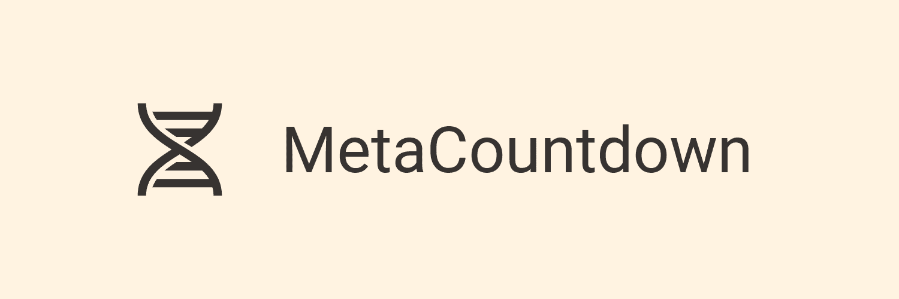

# MetaCountdown
> A complex problem made simple!

(WIP)

## Origin

(WIP)

## Contributing

This project is currently being developed only by me (Víctor Dorado), but if anyone is interested in contributing to the project, feel free to open some issues, fork the repository and make pull requests or contact me. Every bit of help is welcome!

## References

[1] https://en.wikipedia.org/wiki/Countdown_(game_show)#Numbers_round

[2] https://en.wikipedia.org/wiki/Genetic_algorithm

[3] https://en.wikipedia.org/wiki/Simulated_annealing

[4] https://github.com/DEAP/deap

[5] https://github.com/perrygeo/simanneal

[6] https://en.wikipedia.org/wiki/Reverse_Polish_notation

[7] https://en.wikipedia.org/wiki/Tree_(data_structure)

## License

This project is licensed under the version 3 of the GNU General Public License. More about it in the [LICENSE file](https://github.com/vicdoja/MetaCountdown/blob/main/LICENSE).